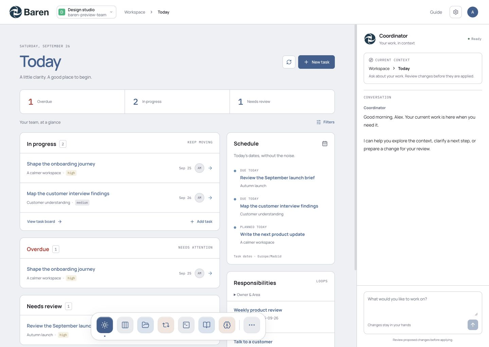
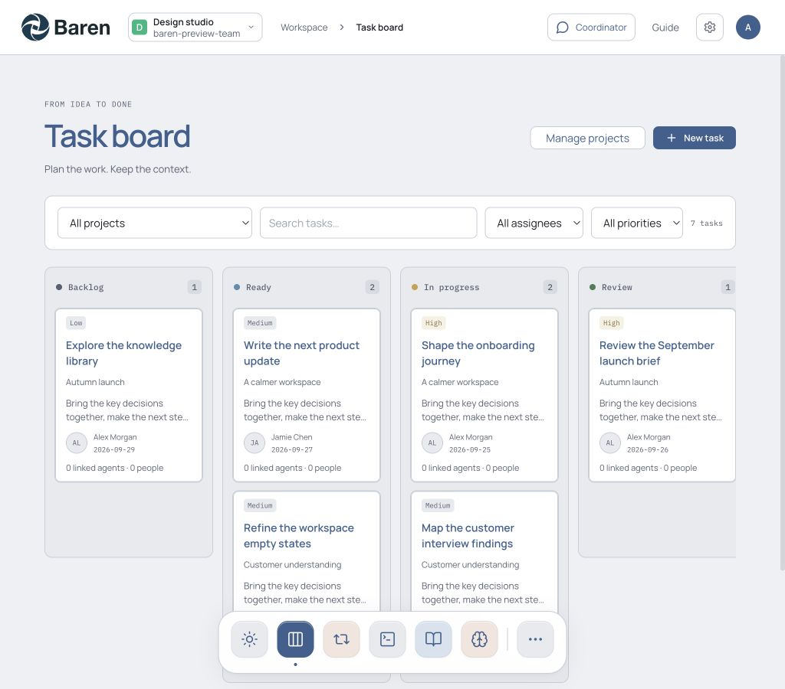
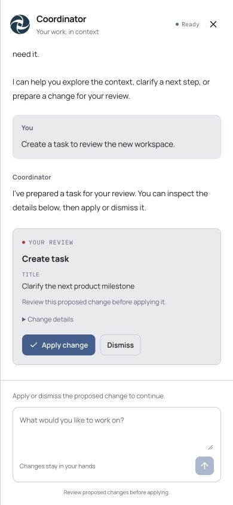

# Baren GUI review

## Open the isolated preview

[Open Today](http://127.0.0.1:5191/#/today).

The preview runs the real application with invented, in-memory data. Reloading resets those records. API calls cannot fall through to a backend; model calls and native runtime connections are blocked. Some advanced mutations deliberately return an unsupported-fixture error. Nothing was merged or deployed.

- Branch: `codex/baren-gui-dock`
- Base: `c0fe398c0cbbed0964c62fb84a02442756998dd5`
- Worktree: `/Users/johngreenhow/Documents/Codex/2026-09-20/i-wa/baren-gui-dock`
- Changes are uncommitted and reviewable in this worktree.
- The original `tencent-workbench` checkout is clean. It advanced independently to `2b7cbc0` during this task; this experiment remains on the explicitly requested base. No changes from those later commits were folded into this experiment.

Restart from `MemoryPanel/web` if needed:

```sh
npm exec vite -- --config tests/baren-preview/vite.config.ts
```

Fixture variants include `?scenario=empty`, `?scenario=loading`, `?scenario=error`, `?role=member`, `?role=reviewer`, `?coordinator=offline`, `?coordinator=error`, `?coordinator=conflict`, `?analytics=off`, and `?auth=login`, all before the hash route. For example: `http://127.0.0.1:5191/?scenario=empty#/projects`.

## Final design

The layout follows the active Penpot Coordinator Workspace board. The user subsequently selected [Meridian Blue](https://21st.dev/@serafimcloud/themes/meridian-blue) for the palette. Exact theme color tokens are shared by Tailwind and Tea; the bundled Manrope and IBM Plex Mono fonts and exported Penpot logo remain.

See the latest [non-modal coordinator verification](COORDINATOR-LAYOUT-QA.md).

The sidebar and visited-page tabs have been replaced with the compact header, six-destination dock, grouped More menu, and persistent coordinator pane. The coordinator shares the grid beside the app at 800px and above, and stacks below it on narrower screens. It can be hidden without losing state. The dock adapts to the available work-area width and scrolls without magnification below 640px. No global search or Plan feature was introduced.

Every owned page was restyled, including Today, task board/detail, Upcoming, collections/resources, administration, runtime host controls, Guide, settings, profile and login. Shared presentation primitives cover headings, panels, summary strips, toolbars, task rows, badges, and empty/error states. Runtime iframe interiors are unchanged.

Projects now live within Task board: project filtering, a Manage projects drawer, creation/editing/archive/restore and Wiki context. New tasks inherit the selected active project. The separate Projects dock item and card status dropdowns are removed; old project URLs redirect into the board. See [combined board verification](COMBINED-BOARD-QA.md).

Browser QA also led to focused fixes: failed task requests now stop loading and offer Retry; small dialogs and drawers stay within the viewport; dialog names, Tab boundaries and return focus are supplied for Tea; help remains accessible on mobile; no-team screens do not reserve an empty coordinator column; narrow resource readers and controls reflow within their actual container.

## Verification

| Check                                          | Result                                                                                                                                                                                                  |
| ---------------------------------------------- | ------------------------------------------------------------------------------------------------------------------------------------------------------------------------------------------------------- |
| Frontend production build                      | Passed. Vite still reports a large main chunk and mixed static/dynamic import warning.                                                                                                                  |
| Full frontend lint                             | 0 errors, 31 warnings; original checkout baseline had 32 warnings.                                                                                                                                      |
| Changed-file formatting and `git diff --check` | Passed.                                                                                                                                                                                                 |
| Whole frontend formatting                      | 91 existing files still fail; baseline was 126. Unrelated files were not mass-formatted.                                                                                                                |
| Panel typecheck and tests                      | Passed: 18 test files, 126 tests.                                                                                                                                                                       |
| Fixture typecheck and isolation/behavior tests | Passed: 6 tests.                                                                                                                                                                                        |
| Production fixture exclusion                   | Built assets contain none of the sample team identifier, fixture API-denial marker or fixture global.                                                                                                   |
| Responsive page review                         | Populated/default routes reviewed at 1440px, 1024px and 390px; empty/loading/error coverage for data-driven routes is listed in the lane reports below. Workbench fixtures cover the disconnected host. |
| Main navigation                                | Dock and all More destinations, role/capability filtering, active routes, More keyboard exit, mobile scrolling and focus checked.                                                                       |
| Routes                                         | Back/forward, project/task deep-link reload and onboarding route targets checked.                                                                                                                       |
| Today/task flow                                | Independent counts, date-only schedule, create-to-detail and status-to-count updates checked with synthetic mutations.                                                                                  |
| Coordinator                                    | Navigation and drawer draft persistence, Apply/Dismiss, conflict recovery, readiness/errors and focus checked with synthetic responses.                                                                 |
| Runtime switching                              | Both visited host panes remain mounted; only the selected pane is visible. No workers launched.                                                                                                         |
| Authenticated browser pass                     | Real sign-in, Today/task lists and resource/onboarding routes rendered through a separate read-only adapter. No live mutations.                                                                         |

The read-only adapter used a named existing credential server-side, returned public session fields only, and rejected mutations/model/launch routes. Coordinator GET was also blocked because that endpoint may save recovery state. This pass proves authenticated rendering, not live proposal application or native runtime execution. The separate adapter and authenticated preview were stopped after QA.

## Verification limits

- Native Orca/cdesktop sessions were not executed; the fixture blocks their connections. Host mounting and existing integration tests were checked.
- Native-select status changes passed. CUA pointer drag and raw OS arrow-key simulation were inconclusive; the existing drag handlers and permissions remain unchanged.
- Reduced-motion CSS and Framer Motion preference handling were reviewed. An operating-system reduced-motion preference was not forced during browser QA.
- Actual Chrome 200% zoom was reviewed across all navigation destinations, Guide, profile, settings, login, and the coordinator after the user approved the follow-up. This found and fixed short-height resource/runtime clipping and an overflowing notification stack. See the [zoom report](ZOOM-QA.md) for exact coverage, fixture boundaries, and evidence. Browser zoom was restored to 100%.
- Payment, ingestion, uploads, secret issuance, real model output and every advanced backend mutation are outside this isolated UI verification. Existing backend tests pass.

Detailed reports: [work pages](WORK-PAGES-QA.md), [coordinator](COORDINATOR-QA.md), [resources and administration](RESOURCE-ADMIN-QA.md). [Fixture commands and boundaries](../MemoryPanel/web/tests/baren-preview/README.md).

## Screenshots







More responsive screenshots are in `screenshots/`, including resources, login/settings, Loops, Timesheets and actual 200% Memory.

## Discard this experiment

These commands intentionally discard all uncommitted work in this experiment. Run them only if rejecting the redesign.

1. Stop the dedicated preview with Ctrl+C in its terminal. If using a different terminal, inspect `lsof -nP -iTCP:5191 -sTCP:LISTEN` and stop only that verified preview process.
2. Leave the experiment directory, then remove its worktree and branch:

```sh
cd /Users/johngreenhow/Documents/Codex/2026-09-20/i-wa
git -C tencent-workbench worktree remove --force /Users/johngreenhow/Documents/Codex/2026-09-20/i-wa/baren-gui-dock
git -C tencent-workbench branch -D codex/baren-gui-dock
```

This leaves the original checkout and deployments in place.
